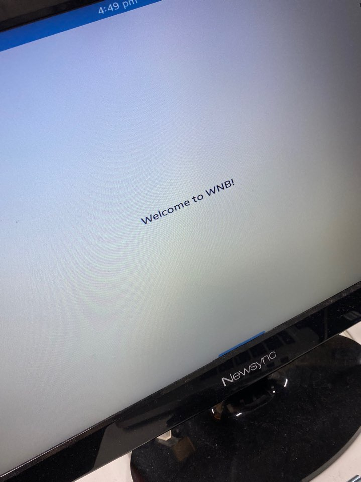
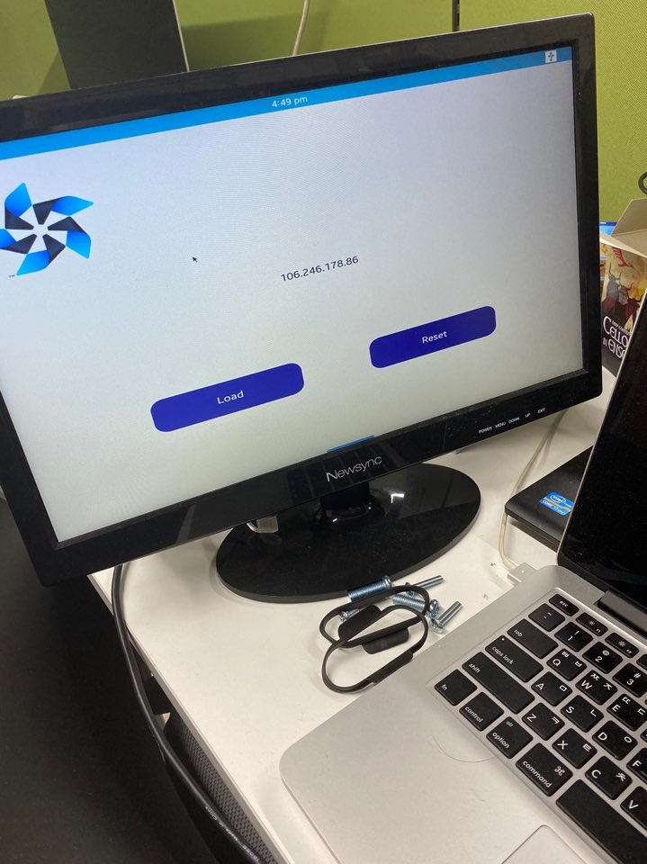
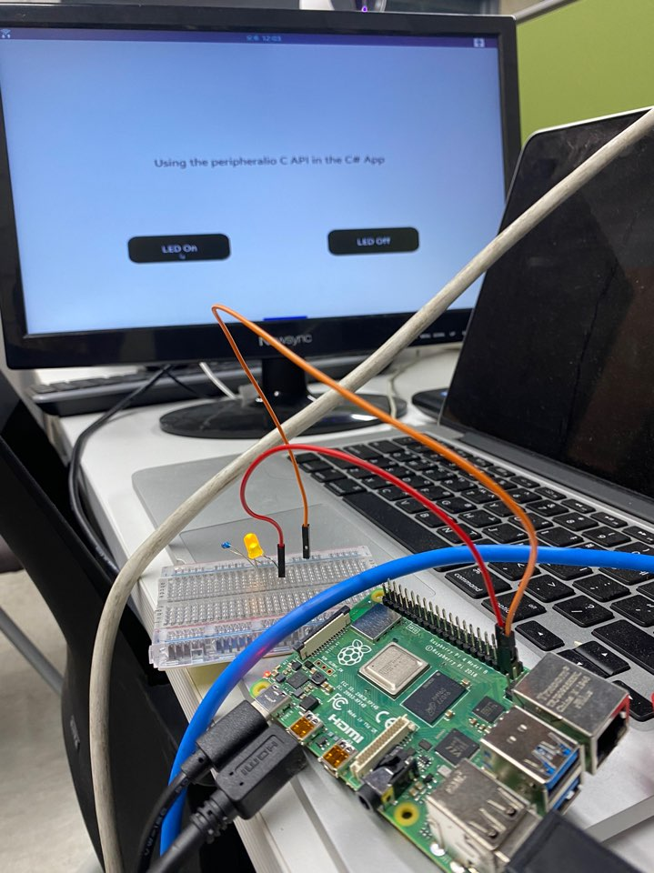

# (2020)서울하드웨어해커톤 - 탑메이커
---
1. [미션1 (8/01)](#미션1)
2. [미션2 (8/08)](#미션2) 
3. [미션3 (8/16)](#미션3)
4. [미션4 (8/29)](#미션4)

---

##  미션1
- Tizen XAML App 프로젝트 생성하기
- 참고사이트: [https://tizenschool.org/tutorial/194/contents/14](https://tizenschool.org/tutorial/194/contents/14)

---

##  미션2
- MyIP: 자신 IP주소를 출력하는 어플리케이션 만들기
- Tizen XAML App
- 참고사이트: [https://tizenschool.org/tutorial/197/contents/2](https://tizenschool.org/tutorial/197/contents/2)

---

## 미션3
- 헤드리스기 어플리케이션을 실행하는 방법 
~~~console
C:\> sdb connect {ip address}
C:\> sdb root on
C:\> sdb shell
sh# service {application}
~~~

---
##  미션4

- C#어플리케이션에서 C API를 호출하는 방법
  

