# (2020)서울하드웨어해커톤 - 탑메이커

---
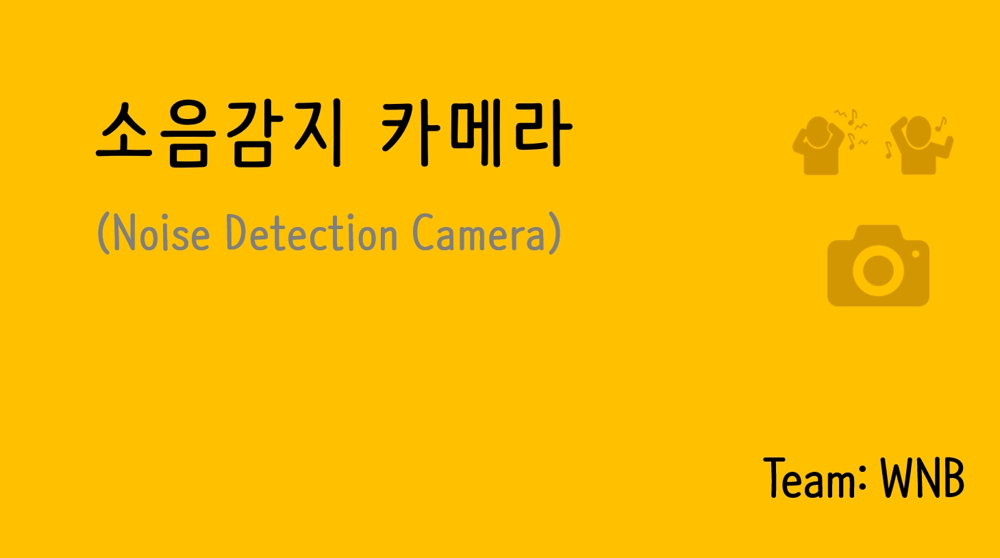
---
1. [WNB 팀소개](#page-1)
2. [서비스 개요](#page-2) 
3. [개발 배경](#page-3)
4. [제작하기](#page-4)
5. [시스템 구성](#page-10)
6. [결과물](#page-11)
7. [시연](#시연)

---

###### Page 1

---

###### Page 2
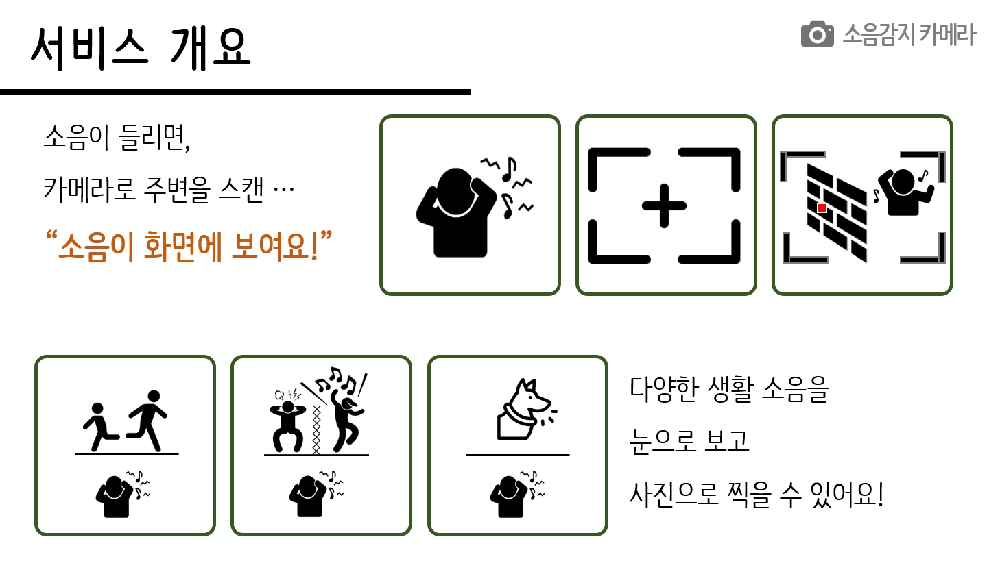

---

###### Page 3
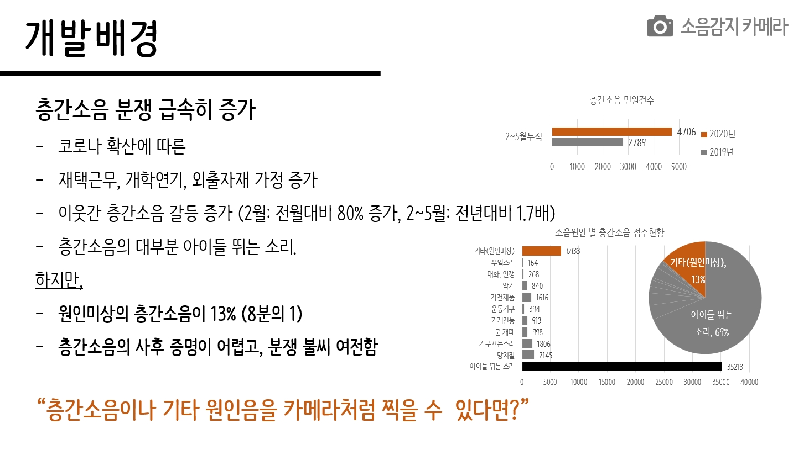

---

###### Page 4
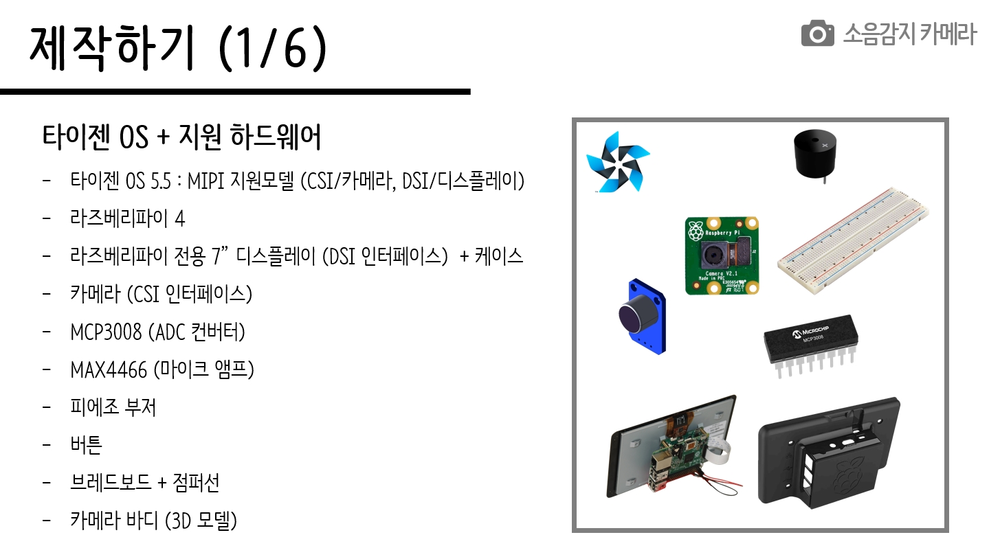
###### Page 5
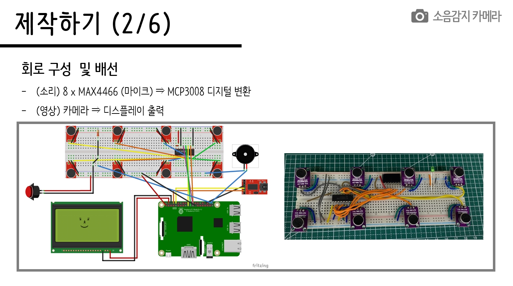
###### Page 6
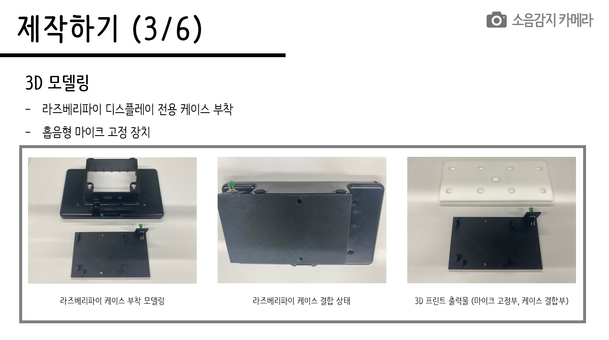
###### Page 7
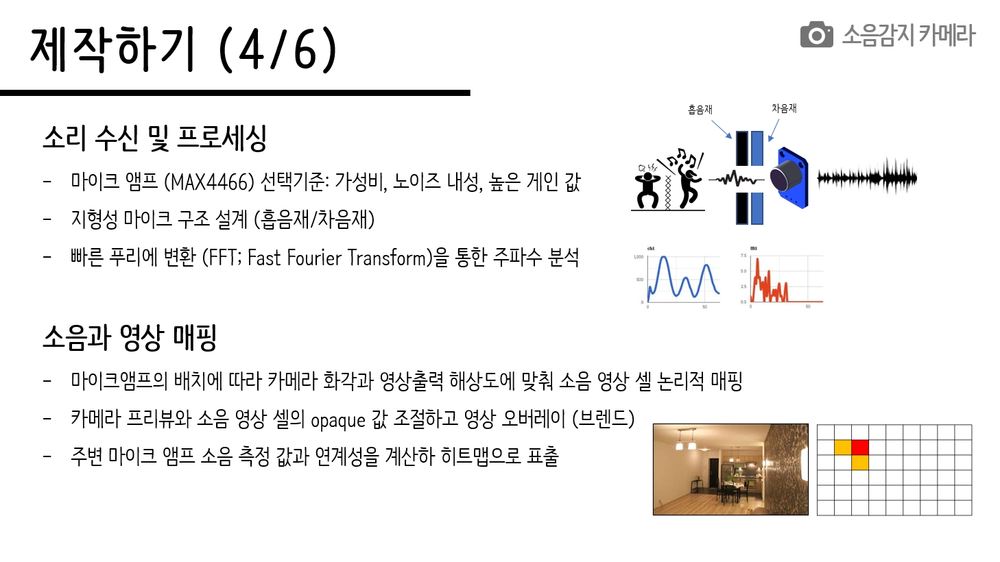
###### Page 8
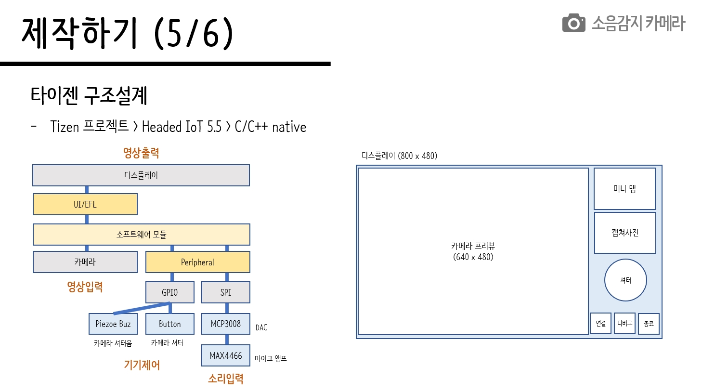

* 디스플레이 UI 구성을 위한 레이아웃 설계

~~~ㅊ
/*
 *  DISPLAY SCREEN LAYOUT
 *  =====================
 *
 *  - Raspberry Pi 7" Touch Screen Display (800 x 600)
 *
 *   <------------ 640 --------------> <----- 160 ----->
 * 	+---------------------------------+-----------------+
 * 	|(0,0)                            | +-------------+ |    noise map
 * 	|                                 | |  NOISE MAP  | |    (120 x 90; 4:3)
 * 	|         CAMERA PREVIEW          | |             | |
 * 	|          (640 x 480)            | +-------------+ |
 * 	|                                 | +-------------+ |
 * 	|                                 | |  SHUTTER    | |
 * 	|                                 | +-------------+ |
 * 	|                                 | +-------------+ |
 * 	|                                 | |  EXIT       | |
 * 	|                        (640,480)| +-------------+ |
 * 	+---------------------------------+-----------------+
 * 	                                   <>              <> 20 (BORDER)
 *                                       <----120----->
 *
 *  SENSOR LAYOUT @CAMERA PREVIEW
 *  =============================
 *
 *  - SCREEN: width x height  = 640 x 380 (4:3)
 *  - SENSOR: width x height  = 160 x 240
 *
 *  <--------------------------640-------------------------->
 *  <----160------> width
 * 	+-------------+-------------+-------------+-------------+
 * 	|             |             |             |             |
 * 	|             |             |             |             |
 * 	|             |             |             |             |
 * 	|  SENSOR#0   |  SENSOR#1   |  SENSOR#2   |  SENSOR#3   |
 * 	|             |             |             |             |
 * 	|             |             |             |             |
 * 	|             |             |             |             |
 * 	|             |             |             |             |
 * 	+-------------+-------------+-------------+-------------+
 * 	|             |             |             |             |
 * 	|             |             |             |             |
 * 	|             |             |             |             |
 * 	|  SENSOR#4   |  SENSOR#5   |  SENSOR#6   |  SENSOR#7   |
 * 	|             |             |             |             |
 * 	|             |             |             |             |
 * 	|             |             |             |             |
 * 	|             |             |             |             |
 * 	+-------------+-------------+-------------+-------------+
 *
 *  HEATMAP CELL LAYOUT @SENSOR
 *  ===========================
 *
 *	- SENSOR: width x height = 160 x 240
 *	- CELL: width x height = 16 x 24 (10 x 10 matrix)
 *  <-16->
 *  +----+----+----+----+----+----+----+----+----+----+
 *  | 00 | 01 | 02 | 03 | 04 | 05 | 06 | 07 | 08 | 08 |
 *  +----+----+----+----+----+----+----+----+----+----+
 *  | 01 |    |    |    |    |    |    |    |    |    |
 *  +----+----+----+----+----+----+----+----+----+----+
 *  | 02 |    |    |    |    |    |    |    |    |    |
 *  +----+----+----+----+----+----+----+----+----+----+
 *  | 03 |    |    |    |    |    |    |    |    |    |
 *  +----+----+----+----+----+----+----+----+----+----+
 *  | 04 |    |    |    |    |    |    |    |    |    |
 *  +----+----+----+----+----+----+----+----+----+----+
 *  | 05 |    |    |    |    |    |    |    |    |    |
 *  +----+----+----+----+----+----+----+----+----+----+
 *  | 06 |    |    |    |    |    |    |    |    |    |
 *  +----+----+----+----+----+----+----+----+----+----+
 *  | 07 |    |    |    |    |    |    |    |    |    |
 *  +----+----+----+----+----+----+----+----+----+----+
 *  | 08 |    |    |    |    |    |    |    |    |    |
 *  +----+----+----+----+----+----+----+----+----+----+
 *  | 09 |    |    |    |    |    |    |    |    |    |
 *  +----+----+----+----+----+----+----+----+----+----+
 *
 */
~~~

* 어플리케이션 데이터 자료구조 (structure)
~~~c
typedef struct {
	int			id;								// sensor #id
	int     	p;								// peak value
	int     	n;                  			// frequency count
	int			o;								// opaque (0..255)
	int			v[NSAMPLE];						// sensor read value
	int 		f[NSAMPLE];						// fast fourier transform matrix mapping value
	double 		a[NSAMPLE];						// fast fourier transform matrix
	void* 		data;
} max4466_t;

typedef struct appdata {
	int 		verbose;						// verbose
	int 		network;						// network availability
	int 		nfail;							// #fail (peer server no response?)
	int			peak;							// noise peak
	int 		freq;							// noise frequency
	int         snap;                        	// please snapshot
	bool		snapshot;
	max4466_t	max4466[NSENSOR];
	int 		s[R_SENSOR][C_SENSOR];			// sensor map opaque
	int         h[R_HEATMAP][C_HEATMAP];		// heat map opaque

	Evas_Object *win;							// baseUI frame object
	Evas_Object *evas;							// windows child object
	Evas_Object *view;							// camera preview object
	Evas_Object *ctrl;							// camera control object
	Evas_Object *heatmap[R_HEATMAP][C_HEATMAP]; // heat map rectangle object
	Evas_Object *minimap[R_SENSOR][C_SENSOR]; 	// heat map rectangle object
	Evas_Object *overlay[R_SENSOR][C_SENSOR]; 	// heat map rectangle object
	Evas_Object *thumbnail;						// thumbnail
	Evas_Object *shot;							// button
	Evas_Object *shot2;							// button
	Evas_Object *conn;							// connection button
	Evas_Object *disc;							// disconnection button
	Evas_Object *debug;							// debug button
	Evas_Object *debug2;						// debug button
	Evas_Object *exit;							// exit

	Ecore_Idler *idler;
	Ecore_Timer *timer;
} appdata_t;
~~~

###### Page 9
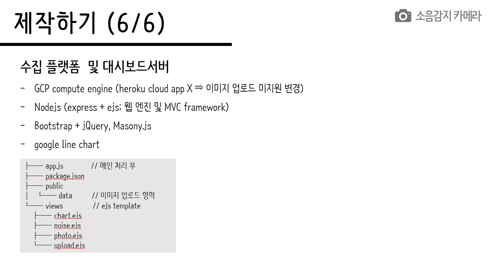

---

###### Page 10
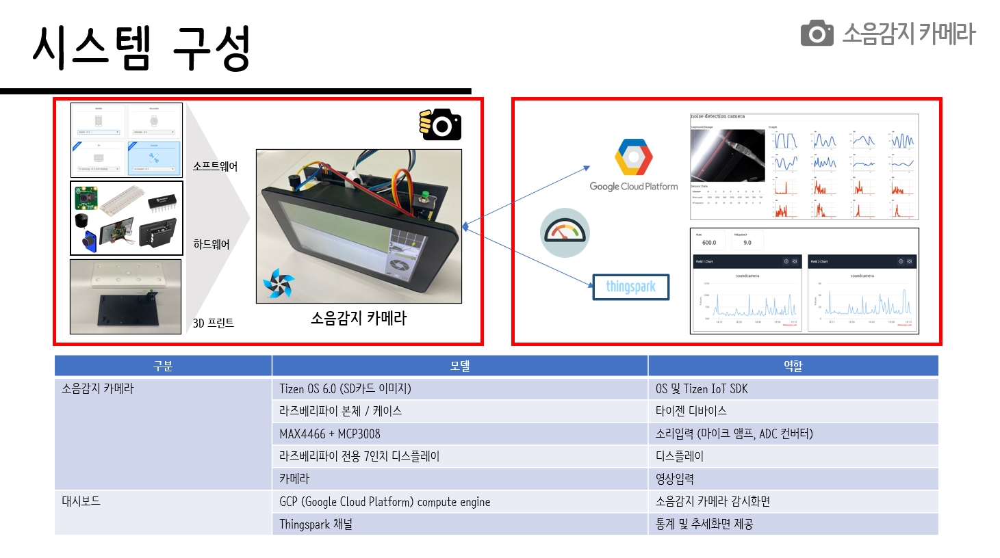

---

###### Page 11
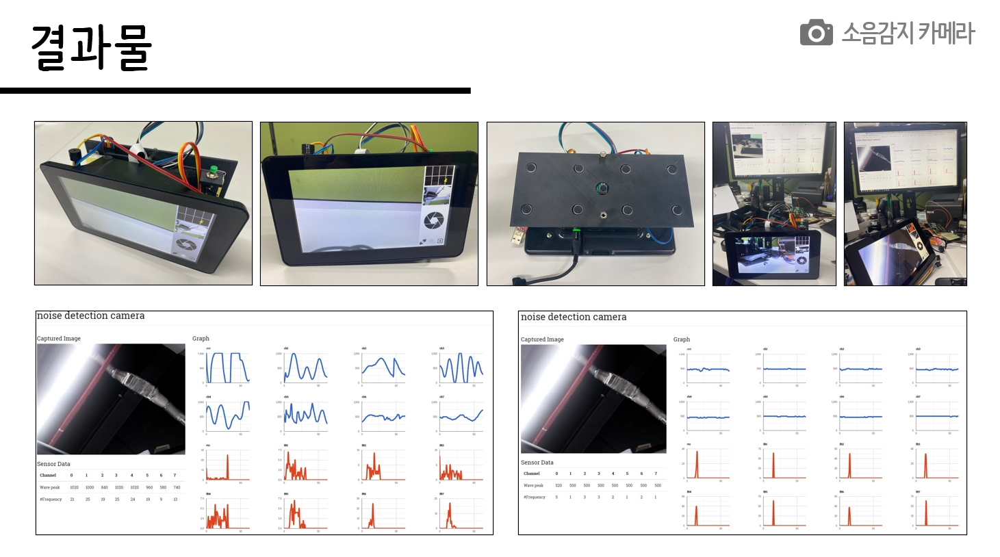
###### Page 12
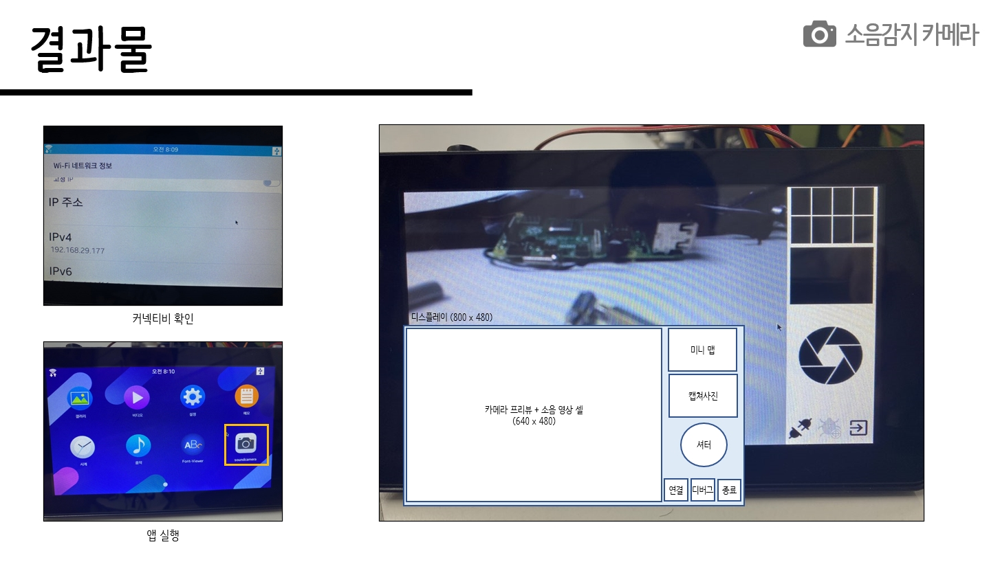

---

## 시연

#### 시연절차
1) 소음감지 카메라전원 ON (외부전원 또는 휴대용배터리>2.3A USB케이블)
2) 와이파이(WiFi) 연결상태 확인 (SSID 및 할당된 IPv4 주소확인)
3) 동일 네트워크에 연결된 노트북에서 원격디바이스 접속 (디버깅용)
   ~~~console
   C:\> sdb connect {ip주소}
   C:\> sdb root on
   C:\> sdb shell
   sh # dlogutil soundcamera
   ~~~

4) 노트북에서 소음감지 카메라 [모니터링 웹 접속](http://debian.tric.kr:9900)
4) 노트북에서 소음감지 카메라 [클라우드 웹 접속](https://thingspark.co.kr/channels/65697)
5) 소음감지카메라 어플리케이션기동
6) 어플리케이션에서 서버와 접속여부 아이콘 확인
7) 어플리케이션에서 디버깅 아이콘 ON/OFF
8) 어플리케이션에서 사진찍어 업로드하기 (물리버튼 또는 화면버튼 클릭)
9) 모니터링화면에 사진이 업로드되는지 확인
10) 소리나는 주변을 스캔하고 사진찍기

#### 대시보드 (dashboard)

대시보드연동|화면|링크
---|---|---
|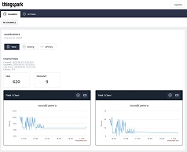|[https://thingspark.co.kr/channels/65697](https://thingspark.co.kr/channels/65697)
|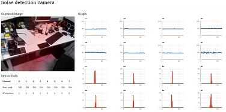|[http://debian.tric.kr:9900/](http://debian.tric.kr:9900/)

---

